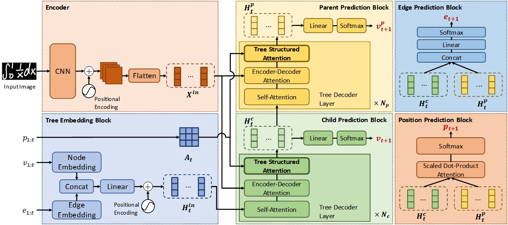

# A Tree-Based Structure-Aware Transformer Decoder for Image-To-Markup Generation

This is the [PyTorch](https://pytorch.org/) and [PyTorch Lightning](https://www.pytorchlightning.ai/) implementation of our paper: *A Tree-Based Structure-Aware Transformer Decoder for Image-To-Markup Generation*.

Reference:
> Shuhan Zhong, Sizhe Song, Guanyao Li, and S.-H. Gary Chan. 2022. A Tree-Based Structure-Aware Transformer Decoder for Image-To-Markup Generation. In Proceedings of the 30th ACM International Conference on Multimedia (MM ’22), Oct. 10–14, 2022, Lisboa, Portugal. ACM, New York, NY, USA, 10 pages. https://doi.org/10.1145/3503161.3548424


## Dependency Setup
* Create a conda virtual environment
  ```bash
  conda create -n tsdnet python=3.8
  conda activate tsdnet
  ```
* Install Python Packages
  ```bash
  pip install -r requirements.txt
  ```

## Dataset Preparation
### Mathematical Expression Recognition
Please download our preprocessed *CROHME* dataset from [crohme.zip](https://hkustconnect-my.sharepoint.com/:u:/g/personal/szhongaj_connect_ust_hk/Eboce3v8NHRNiD9mcIwANUoBvAt2i5eKyXW1L4qdGuq0_Q?e=fY8HcM), unzip and structure the data as follows:
```
/path/to/tsdnet/data/
  crohme/
    train2014/
      bmp/
      tree/
      metadata.txt
    test2014/
      bmp/
      tree/
      metadata.txt
    test2016/
      bmp/
      tree/
      metadata.txt
    test2019/
      bmp/
      tree/
      metadata.txt
    edge_dict.txt
    node_dict.txt
```
### Chemical Formula Recognition
Please download our preprocessed *ZINC* dataset from [zinc.zip](https://hkustconnect-my.sharepoint.com/:u:/g/personal/szhongaj_connect_ust_hk/EQQfSrxFbT1Lk_xmwbwrBA4BhXDwqgIguOyRtUchKPSn2A?e=8zk1ur), unzip and structure the data as follows:
```
/path/to/tsdnet/data/
  zinc/
    png/
    tree/
    easy_splits.pkl
    mid_splits.pkl
    hard_splits.pkl
    full_splits.pkl
    edge_dict.txt
    node_dict.txt
    metadata.txt
```
## Evaluation
Please use `python main.py test` for evaluation, please use the `-h` or `--help` argument to show the details.
### Mathematical Expression Recognition
Please download our model trained on the *CROHME* dataset [tsdnet_crohme.pt](https://hkustconnect-my.sharepoint.com/:u:/g/personal/szhongaj_connect_ust_hk/EZN0HRNR14JKiHiP77yeLcsBXNaT3-PVdxAlLdWOR0J0mw?e=5HspEI). The example evaluation command is shown as follows:
```
python main.py test --dataset crohme --config "configs/crohme.yml" --state_dict "/path/to/tsdnet_crohme.pt" --gpu 0
```
### Chemical Formula Recognition
Please download our model trained on the *ZINC* dataset [tsdnet_zinc.pt](https://hkustconnect-my.sharepoint.com/:u:/g/personal/szhongaj_connect_ust_hk/EajpLjcKpk9JsdkHs_U9LpYBRlMsmTk9q2Ar4JBpyxRnlQ?e=BFDWJH). The example evaluation command is shown as follows:
```
python main.py test --dataset zinc --config "configs/zinc.yml" --state_dict "/path/to/tsdnet_zinc.pt" --gpu 0
```
## Training
Please use `python main.py train` for training, please use the `-h` or `--help` argument to show the details.
### Mathematical Expression Recognition
The example training command is shown as follows:
```
python main.py train --dataset crohme --log_dir tsdnet_logs --exp_name crohme --config "configs/crohme.yml" --gpu 0 --progress_bar
```
The training log will be saved to `tsdnet_logs/crohme`.
### Chemical Formula Recognition
The example training command is shown as follows:
```
python main.py train --dataset zinc --log_dir tsdnet_logs --exp_name zinc --config "configs/zinc.yml" --gpu 0 --progress_bar
```
The training log will be saved to `tsdnet_logs/zinc`.
